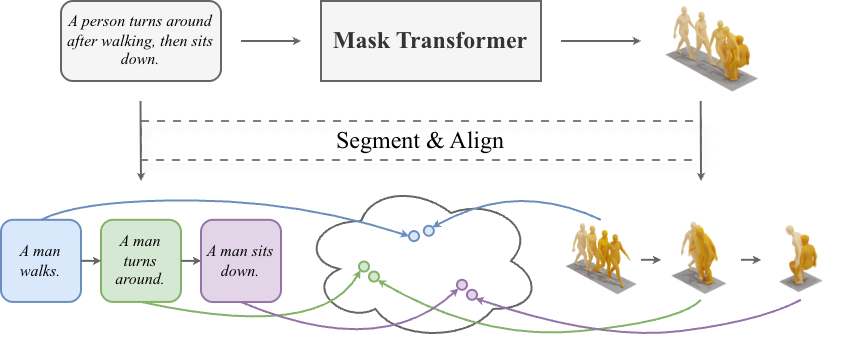

# SegMo: Segment-aligned Text to 3D Human Motion Generation (WACV 2026)

Code repository for the paper "SegMo: Segment-aligned Text to 3D Human Motion Generation".




## Contents

1. [Install](#install)
2. [Run](#run)
3. [Reference](#reference)


## Install

This code respository is based on MoMask, please refer to [this](https://github.com/EricGuo5513/momask-codes) repository for the installation of the environment.

Specifically, you will need to download the following data before running the code:

- [HumanML3D](https://github.com/EricGuo5513/HumanML3D) dataset.
- [KIT-ML](https://motion-annotation.humanoids.kit.edu/dataset/) dataset processed in [HumanML3D](https://github.com/EricGuo5513/HumanML3D) format.
- Glove data used for the word vectorizer.
- Evaluators from [MoMask](https://github.com/EricGuo5513/momask-codes).


## Run

#### Train the Residual VQ-VAE

```
python train_rvq.py --exp-name vq_name
```

You can skip this step using the trained models provided by MoMask.

#### Train the Mask Transformer

```
python train_mtrans.py --exp-name mtrans_name --vq-name vq_name
```

#### Train the Residual Transformer

```
python train_rtrans.py --exp-name rtrans_name --vq-name vq_name --mtrans-name mtrans_name
```

#### Evaluation

```
python eval.py --vq-name vq_name --mtrans-name mtrans_name --rtrans-name rtrans_name
```


## Reference

Our code is based on [MoMask](https://ericguo5513.github.io/momask/). Thanks to these authors for their great work.